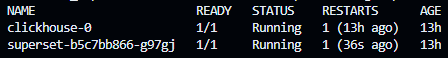
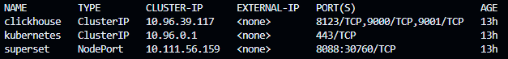
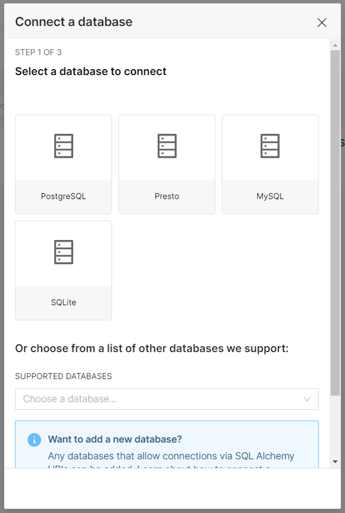
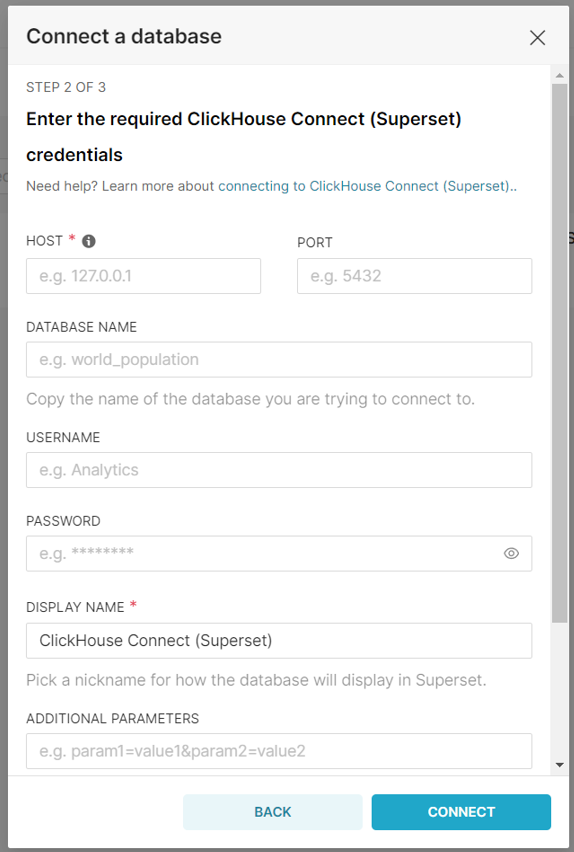
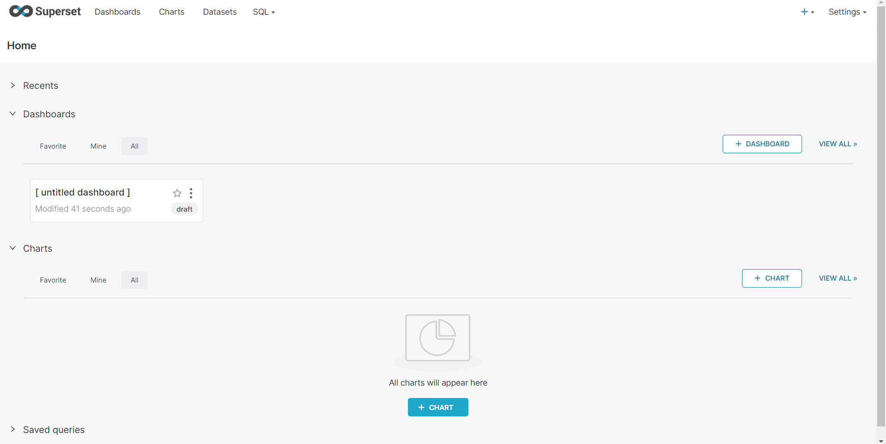

# Setup Instructions

## Pre-requisites
* Install [Docker](https://docs.docker.com/get-docker/)
* Install [Minikube](https://minikube.sigs.k8s.io/docs/start/?arch=%2Fwindows%2Fx86-64%2Fstable%2F.exe+download) - Kubernetes
* Brief knowledge of [Clickhouse](https://clickhouse.com)
* Read a bit about [Superset](https://superset.apache.org)

Install the requirements mentioned above onto your local machine.

## Things to keep in mind
* Make sure you have at least 4GB of RAM idle for use to ensure smooth operation of the programs.
* Make sure you navigate to the correct directory in you local machine when executing commands through Terminal/Powershell.

## Setup
1. Clone the repository onto your local machine:
```
git clone <web-url>
```

<br>

2. Change directory to the project's root folder.

<br>

3. Install and run the Docker Desktop Application.

<br>

4. Open the Terminal and run:
```
minikube start --driver=docker
```

<br>

5. To apply the `configurations defined in a YAML file` to your Kubernetes cluster:
```
kubectl apply -f <file-name>.yaml
```

<br>

6. To expose the Superset deployment in your Kubernetes cluster:
```
kubectl expose deployment superset --type=NodePort --port=8088
```

<br>

7. To list all the `pods` in your Kubernetes cluster:
```
kubectl get pods
```


<br>

8. To list all the `services` in your Kubernetes cluster:
```
kubectl get services
```
Note the CLUSTER-IP *(10.96.37.117)* of `clickhouse` and its PORT *(8123)*.
<br>


<br>

9. To access the `superset` service in Minikube:
minikube service superset

<br>

10. A URL will appear in your terminal. Open the URL on a Web Browser, and log in to Superset:<br>
Username: `admin`<br>
Password: `admin`

<br>

11. Navigate to `Data > Databases > + Database`.<br>
Choose Clickhouse from the dropdown box.


<br>

12. Configure ClickHouse Connection by filling in these details: <br>
Enter the earlier noted CLUSTER-IP *(10.96.37.117)* and PORT *(8123)* into the respective fields.
<br>


## Result

You will encounter a dashboard in Superset.

<br>

